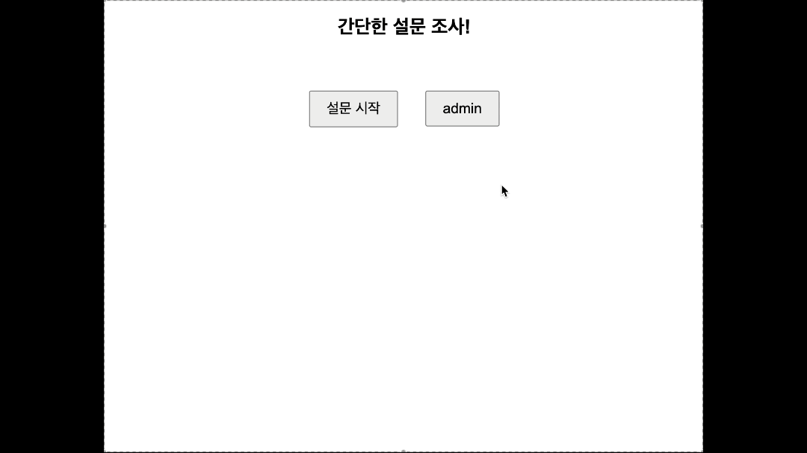
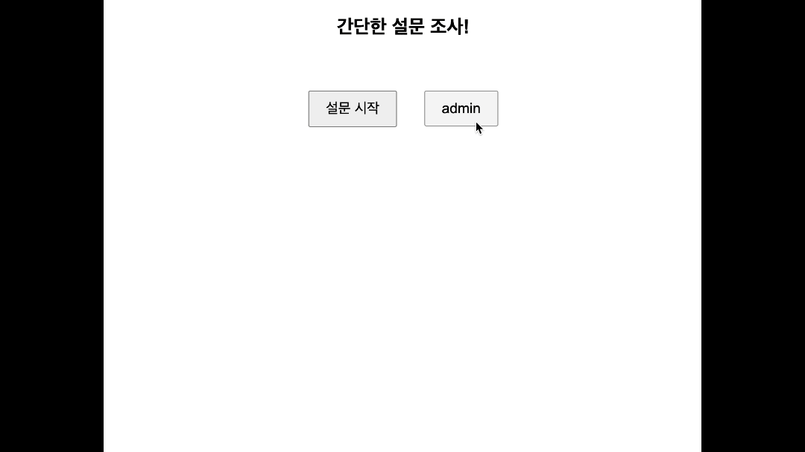

# a survey using flask  작성중...
#### flask를 이용한 설문조사
---

### Guide
- installation
```
git clone https://github.com/mountain-kangkang/flask_survey.git
```


### Version
<div align="center">
    
    
    
    
    
    
    
    
    
</div>

---

### Demo
<details>
<summary>survey ver</summary>


</details>
<details>
<summary>admin ver</summary>


</details>

---
<details>
<summary>중요기능 공사중</summary>

### Routes

- `route(rule, **options)`
    - 매개변수 `rule`에 URL을... 그리고 `options`에 HTTP 메소드 CRUD, 즉 POST, GET, PUT, DELETE를 입력받아 맵핑합니다.
- `def add_participant()` 설문 응답자 정보 수집
    - 설문을 시작하면 설문을 시작하기에 앞서 설문 응답자의 정보를 수집하는 route
    - 설문 응답자의 이름, 나이대, 성별을 JSON 형태로 수집하고, 설문 응답자의 ID를 반환하며 quiz 페이지를 리다이렉션
    .png)
    
- `def quiz()` 설문 시작
    - 데이터베이스에 저장된 설문 항목들을 불러오며 설문 시작
    - 설문 응답자의 ID 값이 없으면 home으로 돌아감
    - 설문 항목들을 순차적으로 출력

</details>

---
### DB Relationship
